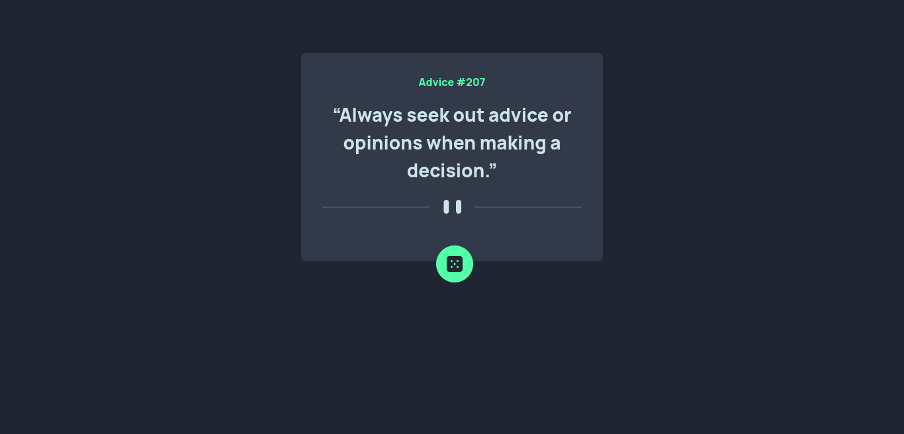

# Advice generator app solution using tailwindcss and react

An application that gives users random advice to help them through tough times or when they are in doubt of themselves.
This is a solution to the [Advice generator app challenge on Frontend Mentor](https://www.frontendmentor.io/challenges/advice-generator-app-QdUG-13db).

## Table of contents

- [Overview](#overview)
  - [The challenge](#the-challenge)
  - [Screenshot](#screenshot)
  - [Links](#links)
- [My process](#my-process)
  - [Built with](#built-with)
- [Author](#author)

## Overview

### The challenge

Users should be able to:

- View the optimal layout for the app depending on their device's screen size
- See hover states for all interactive elements on the page
- Generate a new piece of advice by clicking the dice icon

### Screenshot

### Links

- Solution URL: [Add solution URL here](https://your-solution-url.com)
- Live Site URL: [Add live site URL here](https://your-live-site-url.com)

## My process

### Built with

- Semantic HTML5 markup
- CSS custom properties
- Mobile-first workflow
- [React](https://reactjs.org/) - JS library
- [Tailwindcss](https://nextjs.org/) - Tailwind

## Installation
-Run `npm install` to install all dependancies required.
-Run `npm run dev` to start local development server.

## Author

- Website - [Clinton wambugu](https://clintonwambugu-portfolio.herokuapp.com/)
- Frontend Mentor - [Clinton-dev](https://www.frontendmentor.io/profile/Clinton-dev)
- Twitter - [@WambuguClinton](https://twitter.com/WambuguClinton)

